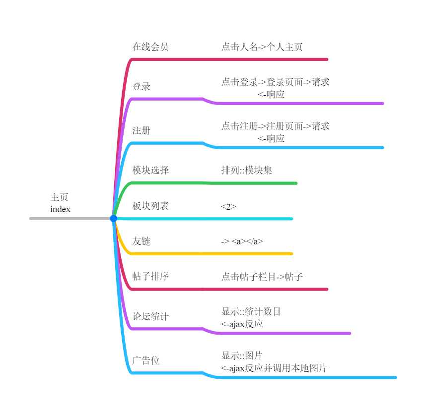
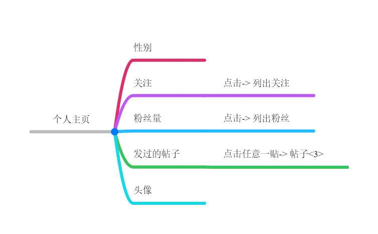
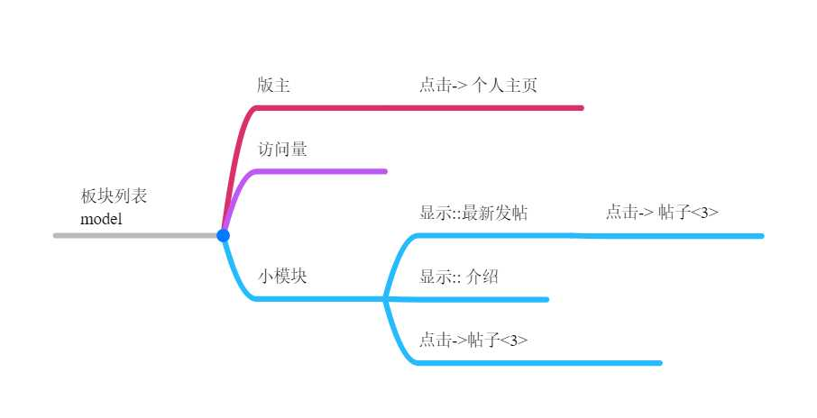
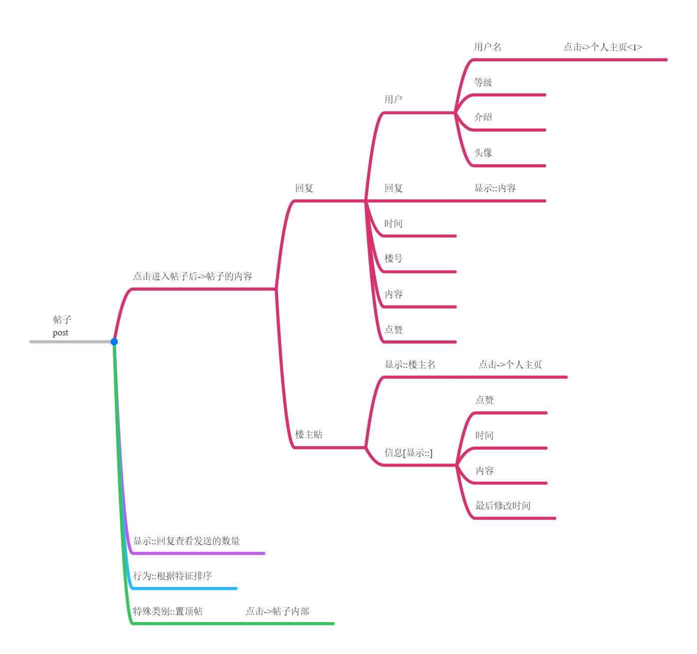
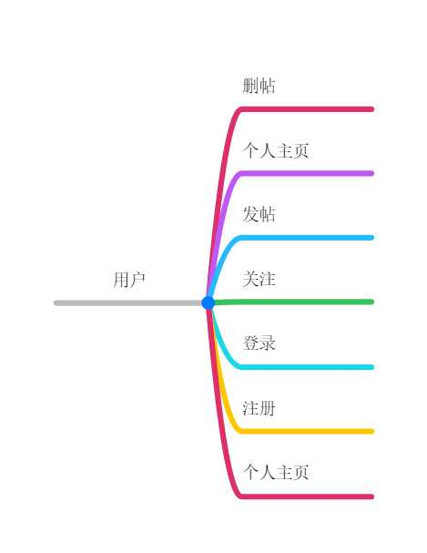
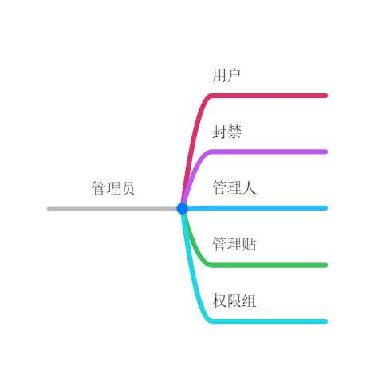
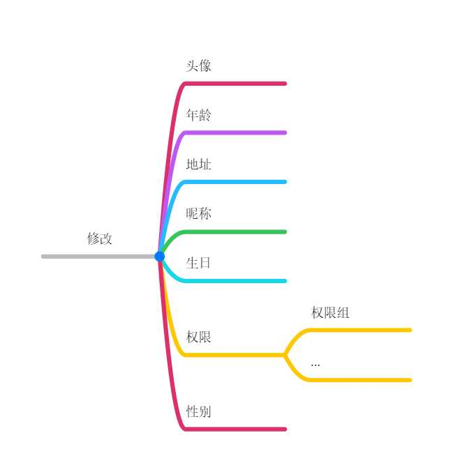

# 对于项目的规范须知

1. 数据库部分
* 数据库部分需要确保本地有一个数据库名为boot_server的数据库
* 确保数据库的密码为85027859，数据库名为root

2. 项目部分

* 确保根据分工需求进行代码工作，在写代码前，务必update，并且推送代码需要合理的写推送信息
* 写完代码推送务必在群中说明已经推送
* 禁止修改其他人的模块，防止冲突和覆盖

3. git及ide

* 使用idea 非社区版进行项目
* idea连接git教程https://www.cnblogs.com/java-maowei/p/5950930.html

4. 项目企划

* 参见网站开发黄皮策划书

# 网站开发黄皮书 V0.3

## 论坛模块设计架构案 V0.3

#### 作者: 卢昶存，贾凯闻，李向杰，黄福鑫，何锐
------
> 结构图

* 主页结构图



1. 个人主页



2. 板块列表



3. 帖子



* 用户行为结构图
1. 用户



2. 管理员



> 持久层的设计

* 用户篇
1. 用户的信息
    * 数据结构
    ```sql
    CREATE TABLE user (
      uid INT AUTO_INCREMENT PRIMARY KEY NOT NULL COMMENT '用户的id',
      username VARCHAR(20) NOT NULL UNIQUE COMMENT '用户的名字',
      nickname VARCHAR(20) COMMENT '用户的昵称',
      password VARCHAR(20) NOT NULL COMMENT '密码',
      gender INT COMMENT '0-男，1-女',
      phone VARCHAR (20) COMMENT '手机号码',
      salt CHAR(36) COMMENT '盐值',
      level_id INT COMMENT '用户等级',--在level表里对应
      address VARCHAR(50) COMMENT '用户的居住地',
      birthday DATETIME COMMENT '用户的出生年月日',
      created_user VARCHAR(20) COMMENT '创建者',
      modified_user VARCHAR(20) COMMENT '修改者',
      created_time DATETIME COMMENT '创建时间',
      modified_time  DATETIME COMMENT '修改时间',
      is_delete INT COMMENT '是否被删除，0-未删除，1-已经删除',
      avatar VARCHAR(50) COMMENT '头像，路径',
      is_admin INT COMMENT '是否是管理员',
      is_ban INT COMMENT '是否被封禁',
      ban_date DATE COMMENT '解封时间'
    );
    ```
2. 处理关注和粉丝部分
    - 数据结构设计
    ```sql

    CREATE TABLE following_list(
      uid INT COMMENT '关注者',
      followed_user INT '被关注者',
    );

    ```
    * sql语句设计

    ```sql
    -- 当用户关注时候的操作
    INSERT 
      INTO 
        following_list
      VALUES 
        (#{uid},#{followed_user});
    -- 根据uid查关注的人
    
    SELECT 
      uid,
      followed_user
    FROM
      following_list
    WHERE 
        uid = #{uid}
    
    
    -- 关注uid查粉丝
    
    SELECT 
           uid,following_user
    FROM
           following_list
    WHERE 
        following_user = #{uid}
    
    --计算关注的人，及他的粉丝量
    
    -- 关注
    
    SELECT 
        COUNT (followed_user)
    FROM
        following_list
    WHERE
        uid = #{uid}
    
    --粉丝
    
    SELECT 
        COUNT (uid)
    FROM
        following_list
    WHERE
        followed_user = #{uid}
    ```

3. 关于帖子的数据设计

- 数据结构
    * 帖子主表
    ```sql
    CREATE TABLE post(
      sid INT AUTO_INCREMENT PRIMARY KEY NOT NULL COMMENT '帖子的id号',
      uid INT NOT NULL COMMENT '发帖的用户的id，即楼主',
      title VARCHAR (100) COMMENT '帖子标题',
      module_id INT COMMENT '所属模块的id',
      created_user VARCHAR(20) COMMENT '创建者',
      modified_user VARCHAR(20) COMMENT '修改者',
      created_time DATETIME COMMENT '创建时间',
      modified_time  DATETIME COMMENT '修改时间',
      is_delete INT COMMENT '是否被删除，0-未删除，1-已经删除',
      create_time INT COMMENT '创建的时间',
      content TEXT COMMENT '楼主帖子的内容'
    );
    ```
    * 关系表
    ```sql
    /*
    一个帖子对应多个回复
     */
    CREATE TABLE relation(
      sid INT COMMENT '帖子的id',
      reply_id INT COMMENT '回复的id'
    );
    ```
    * 回复表
    ```sql
    CREATE TABLE reply(
         reply_id INT  AUTO_INCREMENT PRIMARY KEY NOT NULL COMMENT '回复的id',
         content TEXT COMMENT '回复的内容',
         uid INT COMMENT '用户的id',
         create_time DATETIME COMMENT '创建时间',
         is_delete INT COMMENT '是否被删除',
       );
    ```
    * 板块表
    ```sql
    CREATE TABLE plate(
      pid INT AUTO_INCREMENT PRIMARY KEY NOT NULL COMMENT '板块的id',
      plate_name VARCHAR (20) COMMENT '板块名字',
      admin_uid INT COMMENT '管理员',
      created_user VARCHAR(20) COMMENT '创建者',
      modified_user VARCHAR(20) COMMENT '修改者',
      created_time DATETIME COMMENT '创建时间',
      modified_time  DATETIME COMMENT '修改时间',
      comment VARCHAR (50) COMMENT '悬浮窗备注'
    );
    ```
    * 板块_模块的关系表
    ```sql
    CREATE TABLE relation(
      pid INT COMMENT '板块的id',
      mid INT COMMENT '模块的id',
    );
    ```
    * 模块表
    ```sql
    CREATE TABLE model(
      mid INT AUTO_INCREMENT PRIMARY KEY NOT NULL,
      model_name VARCHAR (20),
      created_user VARCHAR(20) COMMENT '创建者',
      modified_user VARCHAR(20) COMMENT '修改者',
      created_time DATETIME COMMENT '创建时间',
      modified_time  DATETIME COMMENT '修改时间',
      picture VARCHAR (50) COMMENT '模块图片',
      comment VARCHAR (50) COMMENT '悬浮窗备注'
    );
    ```
    * sql语句
    ```sql
    /**
      SQL语句针对主页面的帖子查询和个人页面的帖子
      查询，以及个人信息的查询
    */
    ```
3. 处理等级的部分
    * 数据结构
    ```sql
    CREATE TABLE level(
      level_id INT PRIMARY KEY AUTO_INCREMENT UNIQUE NOT NULL COMMENT '等级的id',
      level_name VARCHAR (20) COMMENT '等级的称号'
    );
    
    -- 插入等级
    
    INSERT 
    INTO 
       level 
    VALUES 
                             (1,'初学者'),
                             (2,'游学者'),
                             (3,'有智者'),
                             (4,'智者'),
                             (5,'仁师'),
                             (6,'仁者 '),
                             (7,'尊者'),
                             (8,'大智尊'),
                             (9,'坛圣');
    ```
    * sql语句
    ```sql
    /**
     SQL语句针对用户的level_id与等级称号的关联
     
    */
    ```
4. 权限组

5. 信息修改



> 业务层

* 异常分析
    * 注册
        * DuplicatedUsernameException
        * InsertException
    * 登录
        * UserNotFoundException <不存在/isDelete==1>
        * PasswordNotCorrectException
    * 修改密码
        * UserNotFoundException
        * PasswordNotCorrectException
        * UpdateException
    * 修改其他信息
        * UserNotFoundException
        * UpdateException
    * 修改头像
        * UserNotFoundException
        * UpdateException
    * 通过uid获取用户信息
        * UserNotFoundException
        * AccessDeniedException 
        

```
noyark system @gulesberry using springboot
        v 0.0.2README
``` 
